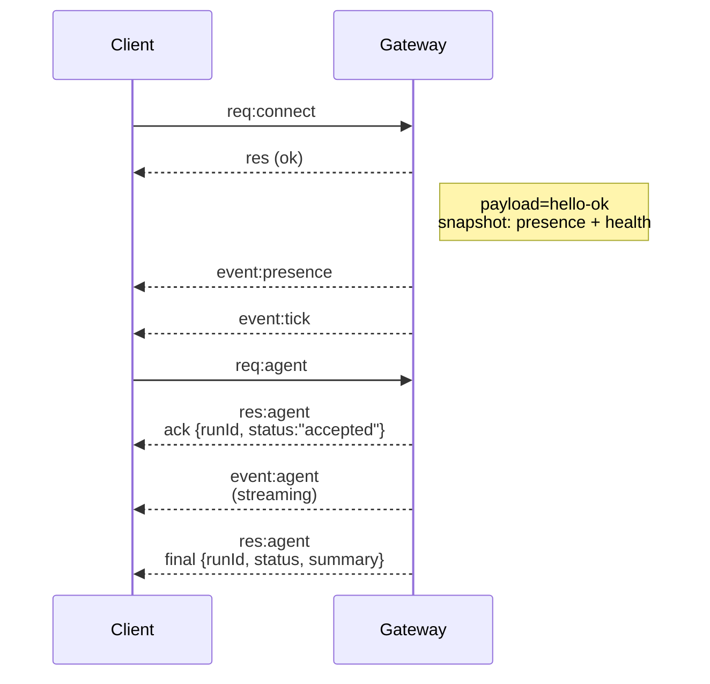

# 🦐 OpenClaw 源码结构完整解析

**创建时间**: 2026-03-18 11:00  
**作者**: 虾老板 (自我探索文档)  
**版本**: OpenClaw v2026.3.7  
**目的**: 理解 OpenClaw 的底层代码结构，实现自我进化

---

## 📂 安装位置

```bash
/home/terrence/.npm-global/lib/node_modules/openclaw/
```

---

## 🏗️ 核心目录结构

```
openclaw/
├── openclaw.mjs              # 入口文件 (Node.js 启动脚本)
├── package.json              # NPM 包配置 (依赖/命令/版本)
├── LICENSE                   # MIT License
├── README.md                 # 项目说明 (122KB)
├── CHANGELOG.md              # 更新日志 (660KB)
│
├── dist/                     # 编译后的 JavaScript 代码 (35MB+)
│   ├── entry.js              # 主入口 (13KB)
│   ├── index.js              # 索引文件 (28KB)
│   ├── gateway-cli-*.js      # Gateway CLI (892KB)
│   ├── daemon-cli.js         # 守护进程 CLI (767KB)
│   ├── agent-scope-*.js      # Agent 作用域 (21KB)
│   ├── cron-cli-*.js         # Cron CLI (30KB)
│   ├── sessions-*.js         # Sessions 管理 (98KB)
│   ├── memory-cli-*.js       # Memory CLI (36KB)
│   ├── skills-*.js           # Skills 系统 (55KB)
│   ├── tools-*.js            # Tools 系统
│   ├── browser-cli-*.js      # Browser CLI (64KB)
│   ├── nodes-cli-*.js        # Nodes CLI (56KB)
│   ├── channels-cli-*.js     # Channels CLI (61KB)
│   ├── models-cli-*.js       # Models CLI (104KB)
│   ├── config-cli-*.js       # Config CLI (12KB)
│   └── ... (300+ 编译文件)
│
├── docs/                     # 官方文档 (58KB)
│   ├── index.md              # 文档首页
│   ├── docs.json             # 文档索引 (58KB)
│   ├── concepts/             # 核心概念 (27 个文档)
│   │   ├── architecture.md   # Gateway 架构
│   │   ├── agent-loop.md     # Agent 循环生命周期
│   │   ├── session.md        # Session 管理
│   │   ├── memory.md         # Memory 系统
│   │   ├── context.md        # Context 组装
│   │   ├── models.md         # 模型配置
│   │   ├── tools.md          # Tools 系统
│   │   ├── skills.md         # Skills 系统
│   │   ├── cron.md           # Cron 调度
│   │   ├── hooks.md          # Hook 系统
│   │   ├── plugins.md        # 插件系统
│   │   └── ...
│   ├── gateway/              # Gateway 文档
│   ├── channels/             # Channels 文档
│   ├── tools/                # Tools 文档
│   ├── automation/           # 自动化文档
│   ├── security/             # 安全文档
│   └── zh-CN/                # 中文文档
│
├── skills/                   # 技能包 (54 个官方技能)
│   ├── healthcheck/          # 健康检查技能
│   ├── weather/              # 天气技能
│   ├── skill-creator/        # 技能创建工具
│   └── ... (51 个技能)
│
├── extensions/               # 扩展系统
│   └── ...
│
├── plugin-sdk/               # 插件 SDK (46 个模块)
│   └── ...
│
├── channels/                 # 渠道集成
│   ├── telegram/             # Telegram
│   ├── whatsapp/             # WhatsApp (Baileys)
│   ├── discord/              # Discord
│   ├── slack/                # Slack
│   ├── signal/               # Signal
│   ├── imessage/             # iMessage
│   └── webchat/              # WebChat
│
├── cli/                      # CLI 工具
│   └── ...
│
├── assets/                   # 静态资源
│   └── ...
│
├── control-ui/               # 控制面板 UI
│   └── ...
│
├── canvas-host/              # Canvas 渲染服务
│   └── ...
│
├── export-html/              # HTML 导出
│   └── ...
│
├── line/                     # Line 渠道
│   └── ...
│
├── telegram/                 # Telegram 专用
│   └── ...
│
└── node_modules/             # 依赖包 (414 个模块)
    └── ...
```

---

## 🔑 核心入口文件

### 1. `openclaw.mjs` (启动脚本)

```javascript
#!/usr/bin/env node

// Node.js 版本检查 (需要 v22.12+)
const MIN_NODE_MAJOR = 22;
const MIN_NODE_MINOR = 12;

// 启用编译缓存
if (module.enableCompileCache) {
  module.enableCompileCache();
}

// 加载警告过滤器
await installProcessWarningFilter();

// 加载主入口
const loaded = await tryImport("./dist/entry.js");
```

**作用**: 
- 检查 Node.js 版本
- 启用编译缓存
- 加载 `dist/entry.js`

---

### 2. `dist/entry.js` (主入口)

**大小**: 13,660 bytes  
**作用**: 
- 解析命令行参数
- 加载 CLI 注册表
- 分发到具体命令

**关键代码流程**:
```
entry.js
  ↓
commands-registry-*.js (32KB)
  ↓
gateway-cli-*.js (892KB) 或 daemon-cli-*.js (767KB)
  ↓
agent-loop / cron / sessions / memory / skills / tools
```

---

### 3. `dist/index.js` (核心索引)

**大小**: 28,155 bytes  
**作用**:
- 导出所有核心模块
- 提供 API 供其他模块调用

---

## 🧠 核心模块详解

### 1. Gateway 模块 (892KB)

**文件**: `dist/gateway-cli-*.js`

**职责**:
- WebSocket 服务器 (默认端口 18789)
- 管理所有 messaging surfaces (WhatsApp/Telegram/Discord/等)
- 处理客户端连接 (macOS app/CLI/Web UI)
- 管理 Nodes (macOS/iOS/Android/headless)
- Canvas 渲染服务 (`/__openclaw__/canvas/`)

**连接流程**:


**关键配置**:
- `bindHost`: `127.0.0.1` (默认)
- `port`: `18789` (默认)
- `token`: `OPENCLAW_GATEWAY_TOKEN` (可选)

---

### 2. Agent Loop 模块 (21KB)

**文件**: `dist/agent-scope-*.js`

**职责**:
- Agent 完整生命周期 (intake → context → inference → tool → reply)
- 序列化 runs (per-session queue)
- 流式输出 (assistant/tool/lifecycle events)
- Timeout 控制 (默认 600 秒)

**生命周期**:
```
1. agent RPC 验证参数
2. 解析 session (sessionKey/sessionId)
3. 持久化 session metadata
4. 返回 { runId, acceptedAt }
5. agentCommand 运行:
   - 解析 model + thinking/verbose 默认值
   - 加载 skills snapshot
   - 调用 runEmbeddedPiAgent
6. runEmbeddedPiAgent:
   - 通过 per-session + global queues 序列化 runs
   - 解析 model + auth profile
   - 订阅 pi events 并流式输出
   - 执行 timeout 检查
7. subscribeEmbeddedPiSession:
   - tool events → stream: "tool"
   - assistant deltas → stream: "assistant"
   - lifecycle events → stream: "lifecycle"
```

**Hook 系统**:
- `before_model_resolve`: 模型解析前
- `before_prompt_build`: prompt 构建前
- `before_agent_start`: Agent 启动前
- `agent_end`: Agent 结束后
- `before_tool_call` / `after_tool_call`: Tool 调用前后
- `before_compaction` / `after_compaction`: Compaction 前后

---

### 3. Session 管理模块 (98KB)

**文件**: `dist/sessions-*.js`

**职责**:
- Session 存储 (`~/.openclaw/agents/<agentId>/sessions/sessions.json`)
- Transcripts (`*.jsonl` 文件)
- Session pruning (30 天自动清理)
- Token 计数追踪

**存储结构**:
```
~/.openclaw/
└── agents/
    └── main/
        └── sessions/
            ├── sessions.json          # Session 索引
            ├── <SessionId>.jsonl      # Telegram transcript
            └── <SessionId>-topic-<threadId>.jsonl  # 群组会话
```

**Session Key 格式**:
- Direct chat: `agent:<agentId>:main`
- Group chat: `agent:<agentId>:<channel>:<groupId>`

**DM Scope 配置**:
```json5
{
  session: {
    dmScope: "main",                  // 所有 DM 共享一个 session (默认)
    // 或
    dmScope: "per-channel-peer",      // 每个渠道 + 发送者独立 session (推荐)
  }
}
```

---

### 4. Cron 调度模块 (30KB)

**文件**: `dist/cron-cli-*.js`

**职责**:
- Cron 作业调度 (`~/.openclaw/cron/jobs.json`)
- 执行记录 (`runs/*.jsonl`)
- 支持 cron/every/at 三种调度类型

**作业结构**:
```json
{
  "id": "uuid",
  "name": "作业名称",
  "enabled": true,
  "schedule": {
    "kind": "cron",           // cron | every | at
    "expr": "0 9 * * *",      // cron 表达式
    "tz": "Asia/Shanghai"
  },
  "sessionTarget": "isolated", // isolated | main
  "payload": {
    "kind": "agentTurn",      // agentTurn | systemEvent
    "message": "任务描述...",
    "model": "qwen3.5-plus",
    "timeoutSeconds": 900
  },
  "delivery": {
    "mode": "none"            // none | announce | webhook
  }
}
```

**执行流程**:
```
Cron Scheduler (每分钟检查)
  ↓
到达执行时间？
  ↓ 是
创建 isolated/main session
  ↓
调用 LLM (payload.message)
  ↓
执行任务
  ↓
记录结果到 runs/*.jsonl
  ↓
更新 jobs.json 中的 state
```

---

### 5. Memory 模块 (36KB)

**文件**: `dist/memory-cli-*.js`

**职责**:
- Memory 搜索 (语义搜索)
- Memory 读取/写入
- Memory 归档

**三层记忆结构**:
```
Level 1: 系统记忆 (.openclaw/memory/)
  - 短期记忆缓存
  - 跨会话上下文

Level 2: 工作区记忆 (workspace/memory/)
  - 每日记忆：YYYY-MM-DD.md
  - 记忆保存：YYYY-MM-DD-HHMM-memory-preservation.md
  - 专项记忆：world-*.md, learning-*.md, 日记-*.md

Level 3: 长期记忆 (workspace/MEMORY.md)
  -  curated 长期记忆
  - 每周/每月回顾更新
```

---

### 6. Skills 模块 (55KB)

**文件**: `dist/skills-*.js`

**职责**:
- Skills 扫描/加载
- Skills 安装/更新
- Skills 状态检查

**官方技能** (54 个):
- `healthcheck`: 安全审计
- `weather`: 天气查询
- `skill-creator`: 技能创建
- ... (51 个)

**技能结构**:
```
skills/<skill-name>/
├── SKILL.md          # 技能说明
├── index.js          # 主代码
├── package.json      # 依赖
└── assets/           # 资源文件
```

---

### 7. Tools 模块

**文件**: `dist/tool-*.js`

**职责**:
- Tool catalog (工具目录)
- Tool execution (工具执行)
- Tool result sanitization (结果清理)

**内置工具**:
- `read`: 读取文件
- `write`: 写入文件
- `edit`: 编辑文件
- `exec`: 执行 shell 命令
- `browser`: 浏览器控制
- `cron`: Cron 管理
- `message`: 消息发送
- `sessions_spawn`: spawn 子会话
- `web_search`: 网络搜索
- `memory_search`: 记忆搜索
- `tts`: 语音合成
- ...

**执行流程**:
```
Agent 决定调用工具
  ↓
Gateway 检查权限 (exec 需要审批)
  ↓
执行工具
  ↓
获取结果
  ↓
结果返回给 Agent
  ↓
Agent 基于结果继续推理
```

---

### 8. Browser 模块 (64KB)

**文件**: `dist/browser-cli-*.js`

**职责**:
- Browser control server
- Playwright 集成
- Chrome extension relay
- Canvas 渲染

**支持的 Profile**:
- `chrome`: Chrome extension relay (用户现有 Chrome)
- `openclaw`: OpenClaw 管理的独立浏览器

**关键功能**:
- `snapshot`: 捕获 UI 状态
- `act`: 执行 UI 操作 (click/type/hover/drag)
- `screenshot`: 截图
- `navigate`: 导航到 URL
- `evaluate`: 执行 JavaScript

---

### 9. Nodes 模块 (56KB)

**文件**: `dist/nodes-cli-*.js`

**职责**:
- Node 配对/发现
- 设备控制 (camera/screen/location/notifications)
- Node 命令执行

**配对流程**:
```
1. Node 发送 connect (包含 device identity)
2. Gateway 检查是否已配对
3. 未配对 → 需要用户批准
4. 已配对 → 签发 device token
5. Node 使用 token 进行后续连接
```

**支持的设备**:
- macOS
- iOS
- Android
- Headless (Linux/Windows)

---

### 10. Channels 模块 (61KB)

**文件**: `dist/channels-cli-*.js`

**职责**:
- Channel 配置管理
- Provider 集成
- Message routing

**支持的渠道**:
- WhatsApp (Baileys)
- Telegram (grammY)
- Discord
- Slack
- Signal
- iMessage
- Line
- WebChat

**配置结构**:
```json5
{
  channels: {
    whatsapp: {
      enabled: true,
      phoneNumber: "+86...",
      // Baileys 配置
    },
    telegram: {
      enabled: true,
      botToken: "bot...",
    },
    // ...
  }
}
```

---

## 🔧 配置文件

### `~/.openclaw/openclaw.json`

**大小**: 4,750 bytes

**核心配置**:
```json5
{
  models: {
    mode: "merge",
    providers: {
      bailian: {
        baseUrl: "https://...",
        apiKey: "sk-...",
        models: [
          {
            id: "qwen3.5-plus",
            contextWindow: 1000000,
            maxTokens: 65536,
          }
        ]
      }
    }
  },
  
  session: {
    dmScope: "per-channel-peer",  // DM session 隔离策略
  },
  
  agents: {
    defaults: {
      timeoutSeconds: 600,  // Agent timeout
    }
  },
  
  cron: {
    // Cron 配置
  },
  
  channels: {
    // Channel 配置
  },
  
  gateway: {
    bindHost: "127.0.0.1",
    port: 18789,
  }
}
```

---

## 📊 数据文件

### 1. `~/.openclaw/cron/jobs.json`

**大小**: 58,424 bytes  
**内容**: 所有 Cron 作业定义

### 2. `~/.openclaw/cron/runs/*.jsonl`

**内容**: 每个作业的执行记录

**记录格式**:
```json
{
  "ts": 1773795981520,
  "jobId": "uuid",
  "action": "finished",
  "status": "ok",
  "summary": "任务摘要...",
  "sessionId": "uuid",
  "durationMs": 381469,
  "model": "qwen3.5-plus",
  "provider": "bailian"
}
```

### 3. `~/.openclaw/agents/main/sessions/sessions.json`

**内容**: Session 索引

### 4. `~/.openclaw/agents/main/sessions/*.jsonl`

**内容**: Session transcripts

---

## 🎯 关键运行逻辑

### 1. 启动流程

```
openclaw gateway
  ↓
openclaw.mjs (版本检查 + 编译缓存)
  ↓
dist/entry.js (CLI 解析)
  ↓
dist/gateway-cli-*.js (892KB)
  ↓
启动 WebSocket 服务器 (18789 端口)
  ↓
加载配置 (~/.openclaw/openclaw.json)
  ↓
加载 Agents
  ↓
加载 Channels
  ↓
启动 Cron Scheduler
  ↓
Gateway 就绪
```

### 2. Agent 执行流程

```
用户发送消息
  ↓
Channel 接收消息
  ↓
Gateway 路由到 Agent
  ↓
创建/加载 Session
  ↓
组装 Context (system prompt + skills + memory)
  ↓
调用 LLM
  ↓
流式输出 (assistant deltas)
  ↓
Tool 调用 (如果需要)
  ↓
执行 Tool
  ↓
继续推理
  ↓
输出最终回复
  ↓
保存到 Session transcript
  ↓
通过 Channel 发送回复
```

### 3. Cron 执行流程

```
Cron Scheduler (每分钟检查)
  ↓
检查 jobs.json
  ↓
发现到达执行时间的作业
  ↓
创建 isolated/main session
  ↓
加载 payload.message
  ↓
调用 LLM
  ↓
执行任务
  ↓
记录结果到 runs/*.jsonl
  ↓
更新 jobs.json 中的 state
```

---

## 🔍 调试技巧

### 1. 查看日志

```bash
# Gateway 日志
tail -f ~/.openclaw/logs/*.log

# 实时日志
openclaw logs --follow
```

### 2. 检查状态

```bash
# Gateway 状态
openclaw gateway status

# Cron 状态
openclaw cron status

# Session 状态
openclaw sessions list

# Agent 状态
openclaw status
```

### 3. 调试工具

```bash
# 安全审计
openclaw security audit

# 诊断
openclaw diagnostic

# 配置检查
openclaw config get
```

---

## 🛠️ 扩展点

### 1. Skills

**位置**: `~/.npm-global/lib/node_modules/openclaw/skills/`

**创建技能**:
```bash
openclaw skills create my-skill
```

### 2. Plugins

**位置**: `~/.npm-global/lib/node_modules/openclaw/plugin-sdk/`

**Hook 类型**:
- `before_model_resolve`
- `before_prompt_build`
- `before_agent_start`
- `agent_end`
- `before_tool_call` / `after_tool_call`
- `before_compaction` / `after_compaction`

### 3. Custom Tools

通过 Skills 添加自定义工具。

---

## 📈 性能优化

### 1. Token 优化

- 启用 compaction (自动压缩长对话)
- 使用 `session.maintenance.pruneAfter: "30d"`
- 限制 `maxTokens` 配置

### 2. 启动优化

- 启用编译缓存 (`module.enableCompileCache()`)
- 使用 SSD 存储
- 减少 Skills 数量

### 3. 并发优化

- 使用 per-session queue 避免 race conditions
- 配置 `agents.defaults.timeoutSeconds` 避免长时间阻塞

---

## 🔐 安全机制

### 1. Gateway 认证

- Token 认证 (`OPENCLAW_GATEWAY_TOKEN`)
- Device pairing (设备配对)
- Local trust (本地自动批准)

### 2. Exec 安全

- 默认需要用户审批
- Allowlist (信任的命令)
- 记录所有执行到 `exec-approvals.json`

### 3. Session 安全

- `dmScope: "per-channel-peer"` (隔离 DM)
- Session pruning (30 天自动清理)
- Transcript 归档

---

## 📝 总结

**OpenClaw 是一个完整的 AI Agent 框架**，包含：

1. **Gateway**: WebSocket 服务器，管理所有 messaging surfaces
2. **Agent Loop**: 完整的 Agent 生命周期管理
3. **Session**: 会话管理和持久化
4. **Cron**: 定时任务调度
5. **Memory**: 三层记忆系统
6. **Skills**: 可扩展的技能系统
7. **Tools**: 内置工具执行
8. **Browser**: 浏览器控制
9. **Nodes**: 设备配对和控制
10. **Channels**: 多渠道集成

**核心设计理念**:
- **单一 Gateway**: 一个主机一个 Gateway，集中管理
- **Session 隔离**: per-channel-peer 隔离策略
- **流式输出**: 实时流式 assistant/tool events
- **Hook 系统**: 丰富的扩展点
- **安全优先**: token 认证、device pairing、exec 审批

---

**持续更新中...** 🦐
